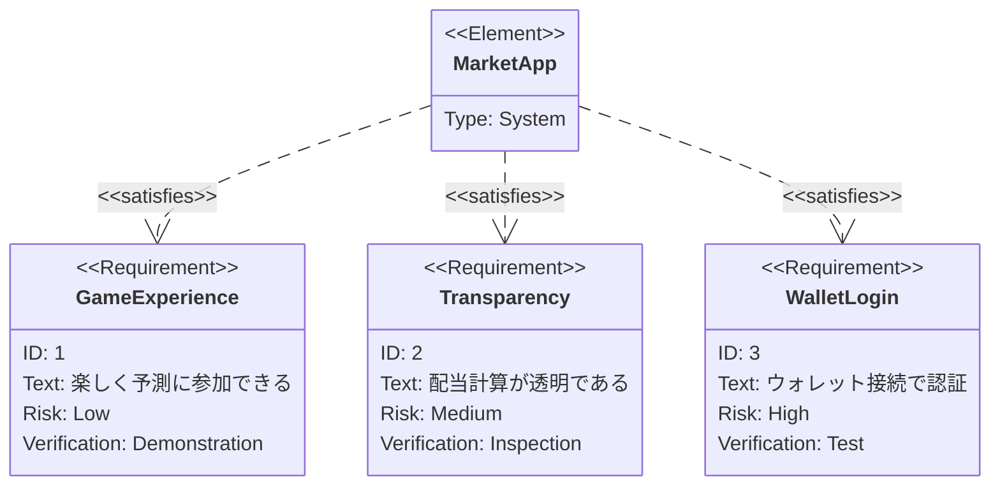

```mermaid
requirementDiagram
    requirement GameExperience {
        id: 1
        text: "楽しく予測に参加できる"
        risk: Low
        verifymethod: Demonstration
    }
    requirement Transparency {
        id: 2
        text: "配当計算が透明である"
        risk: Medium
        verifymethod: Inspection
    }
    requirement WalletLogin {
        id: 3
        text: "ウォレット接続で認証"
        risk: High
        verifymethod: Test
    }
    element MarketApp {
        type: System
    }
    MarketApp - satisfies -> GameExperience
    MarketApp - satisfies -> Transparency

    MarketApp - satisfies -> WalletLogin
```
