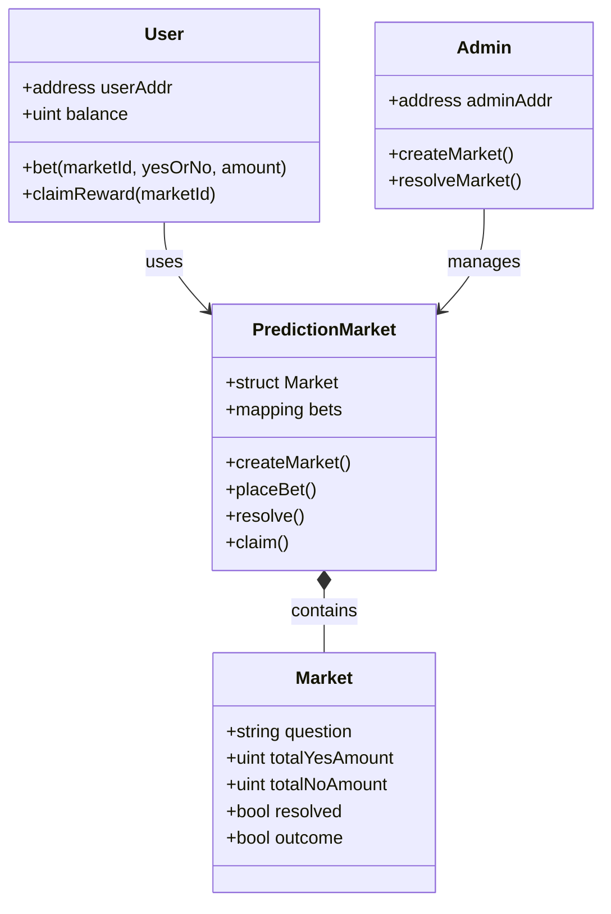

```mermaid
classDiagram
    class Admin {
        +address adminAddr
        +createMarket()
        +resolveMarket()
    }
    class User {
        +address userAddr
        +uint balance
        +bet(marketId, yesOrNo, amount)
        +claimReward(marketId)
    }
    class PredictionMarket {
        +struct Market
        +mapping bets
        +createMarket()
        +placeBet()
        +resolve()
        +claim()
    }
    class Market {
        +string question
        +uint totalYesAmount
        +uint totalNoAmount
        +bool resolved
        +bool outcome
    }
    
    User --> PredictionMarket : uses
    Admin --> PredictionMarket : manages

    PredictionMarket *-- Market : contains
```
