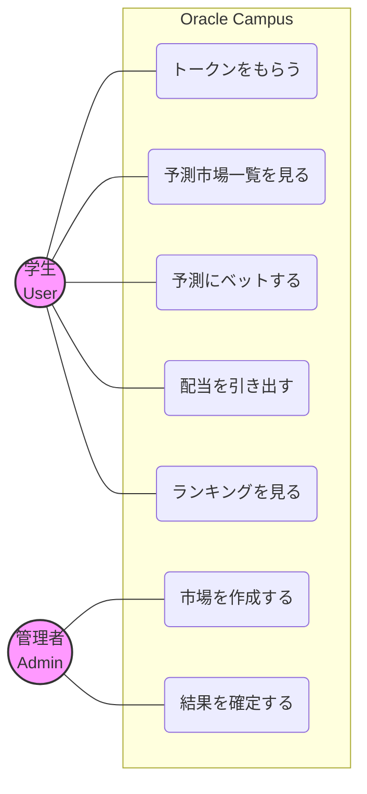

```mermaid
graph LR
    %% アクターの定義
    Student((学生<br>User))
    Admin((管理者<br>Admin))

    %% ユースケース（機能）の定義
    subgraph OracleCampus [Oracle Campus]
        UC1(トークンをもらう)
        UC2(予測市場一覧を見る)
        UC3(予測にベットする)
        UC4(配当を引き出す)
        UC5(ランキングを見る)
        UC6(市場を作成する)
        UC7(結果を確定する)
    end

    %% 線の接続
    Student --- UC1
    Student --- UC2
    Student --- UC3
    Student --- UC4
    Student --- UC5

    Admin --- UC6
    Admin --- UC7

    %% 見た目の調整（アクターを丸くする）
    classDef actor fill:#f9f,stroke:#333,stroke-width:2px;
    class Student,Admin actor;

```
